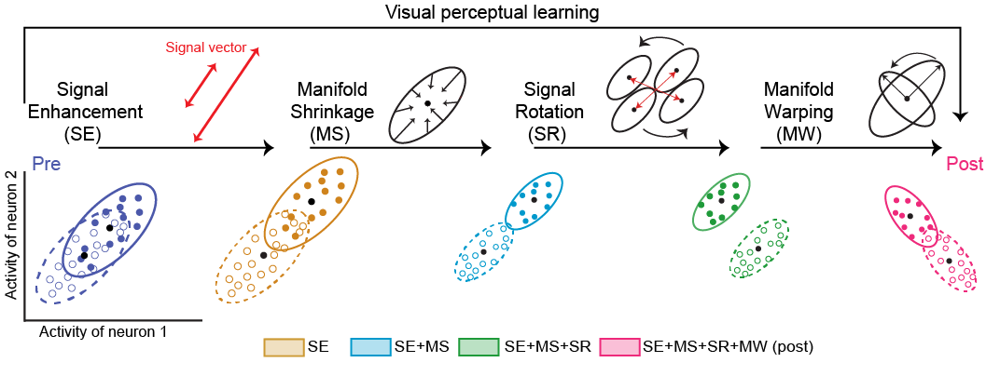

<h1 align="center">
  <br>
  <br>
  A neural geometry theory comprehensively explains apparently conflicting models of visual perceptual learning
  <br>
</h1>

<h4 align="center">Yu-Ang Cheng, Mehdi Sanayei, Xing Chen, Ke Jia, Sheng Li, Takeo Watanabe, Alexander Thiele, & Ru-Yuan Zhang</h4>

<div align="center" width="800">
 <br> 
</p>

</div>


## About
This repo contains code for analyzing the changes of neural networks, human fMRI BOLD signals and macaque multi-unit acitivities from a geometric perspective.

## Citation
This repository was released with the following pre-print. If you use this repository in your research, please cite as:

[Cheng, Y. A., Sanayei, M., Chen, X., Jia, K., Li, S., Fang, F., ... & Zhang, R. Y. (2023). A neural geometry theory comprehensively explains apparently conflicting models of visual perceptual learning. bioRxiv, 2023-11.](https://www.biorxiv.org/content/10.1101/2023.11.13.566963v2)

```
@article{cheng2023neural,
  title={A neural geometry theory comprehensively explains apparently conflicting models of visual perceptual learning},
  author={Cheng, Yu-Ang and Sanayei, Mehdi and Chen, Xing and Jia, Ke and Li, Sheng and Fang, Fang and Watanabe, Takeo and Thiele, Alexander and Zhang, Ru-Yuan},
  journal={bioRxiv},
  pages={2023--11},
  year={2023},
  publisher={Cold Spring Harbor Laboratory}
}
```

# Authors
* **Yu-Ang Cheng** ([https://github.com/Yu-AngCheng](https://github.com/Yu-AngCheng))

# License
This project is licensed under the MIT License - see the [LICENSE.md](LICENSE.md) file for details
